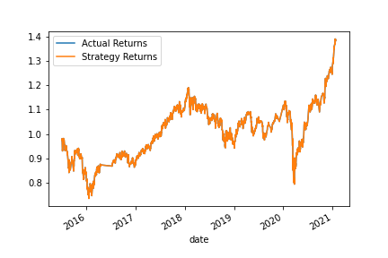

# Module_14_Challenge_ML_AlgoTrading

In this assignment i used new algorithmic trading skills with the existing skills in financial Python programming and machine learning to create an algorithmic trading bot that learns and adapts to new data and evolving markets.

The excercise is divided into three parts:

* Implement an algorithmic trading strategy that uses machine learning to automate the trade decisions.

* Adjust the input parameters to optimise the trading algorithm.

* Train a new machine learning model and compare its performance to that of a baseline model.

### Establish a Baseline Performance

1. Imported the OHLCV dataset into a Pandas DataFrame and generated trading signals using short- and long-window SMA values

2. Divided the datasets into training and test data. Used the `SVC` classifier model from SKLearn's support vector machine (SVM) learning method to fit the training data and make predictions based on the testing data. 

3. Created a predictions DataFrame and cumulative return plot that shows the actual returns vs. the strategy returns.

### Conclusions on performance of baseline algorithm: The baseline algorithm classification report shows an accuracy of 55% which seems to be low and hence some fine tuning of input parameters are needed to make this algo more accurate. The Strategy returns were quite close to actual returns until 2018, howwever the algo returns increased after 2020 and predicted better returns,

### Tune the Baseline Trading Algorithm

1. Tuned the training algorithm by adjusting the size of the training dataset. I used 6 months of training data instead of 3 months which was used for baseline trading algorithm. 

Que. What impact resulted from increasing or decreasing the training window?

Ans. There was not much impact on the startegy returns and the classification report accuracy from increasing the size of training data which shows training data may be similar for the new window.

2. Tune the trading algorithm by adjusting the SMA input features. The small window was changed to 50 days and long window was changed to 100 days.

Que. What impact resulted from increasing or decreasing either or both of the SMA windows?

Ans. By increasing the long tading window to 100 days the accuracy increased a bit, howvwer the startegy returns were same as the actual returns.

### Conclusions: Tuning the SMA windows resulted in a better model but tuning the training data dint do any changes in existing model.

### Evaluate a New Machine Learning Classifier

Imported a logistic regression classifier and used original training data to fit another model.

Imported a Decision tree classifier and used original training data to fit another model.

Que: Did this new model perform better or worse than the provided baseline model?

Ans: The new models accuracy was less than the provided baseline model. The startegy returns for the new models were more than the actual model but the classification report shows decrease in precision and recall score which signifies increased risk of error associaetd with the model.

Que: Did this new model perform better or worse than your tuned trading algorithm?

Ans: The tuned trading algorithm was beteer than the new model and hence SVC Classifier dies a better job in predicting the returns accurately.

### Evaluation Report

The above analysis shows SVC Classifier is a better choice when it comes to designing Machine Learning Algorithmic bot as it predicts the returns more accuartely. Howvwer it requires some fine tuning of input parameters such as SMA to optimize the accuracy of the Model.

